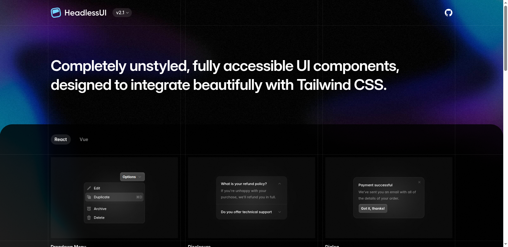
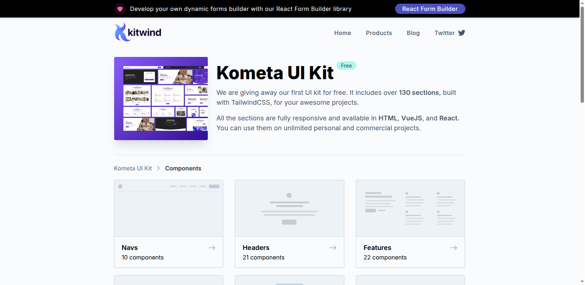
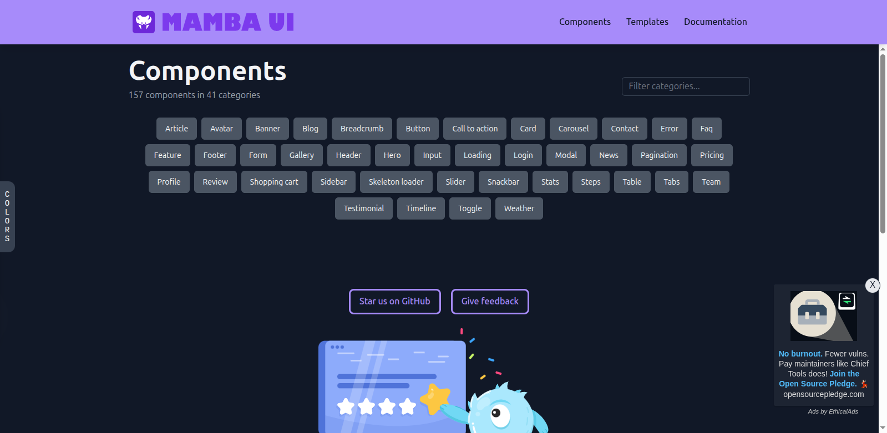
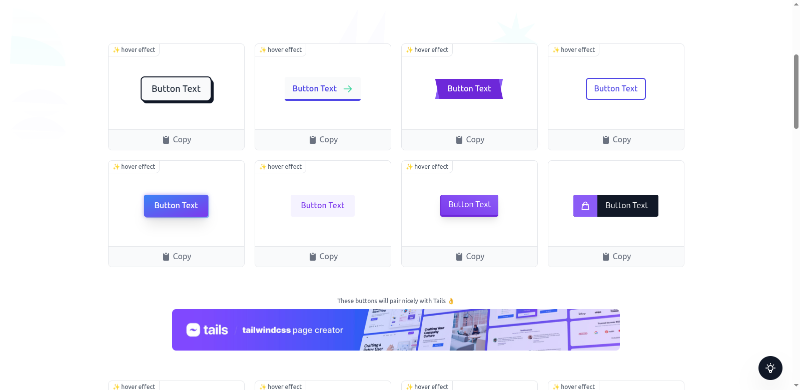
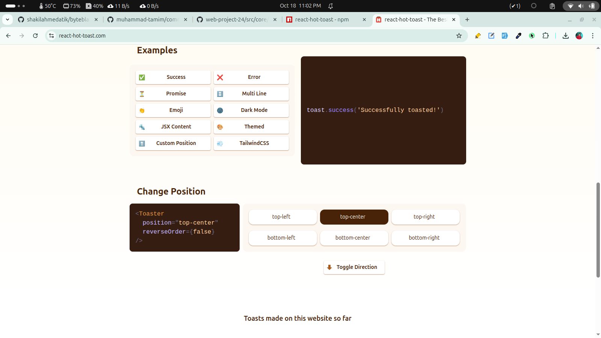
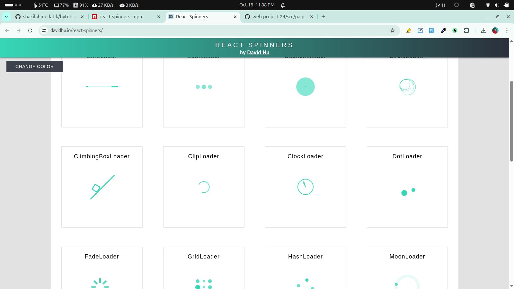
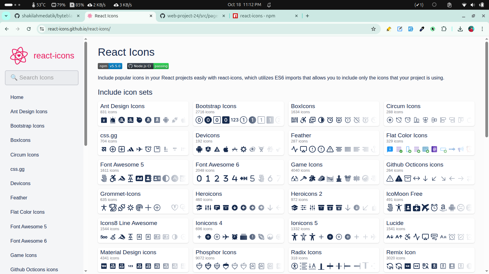

<h1 align="center">Common Resources</h1>

- [UI Component \& elements](#ui-component--elements)
  - [headless ui:](#headless-ui)
  - [Kometa Ui:](#kometa-ui)
  - [Mumba Ui:](#mumba-ui)
  - [tailwind css buttons:](#tailwind-css-buttons)
- [React packages](#react-packages)
  - [react-hot-toast:](#react-hot-toast)
  - [react-spinner:](#react-spinner)
  - [react-icons:](#react-icons)
- [My-UI Components:](#my-ui-components)
  - [Navbar:](#navbar)
  - [Hero](#hero)

## UI Component & elements

### headless ui:
[Headless ui](https://headlessui.com/) - Completely unstyled, fully accessible UI components, designed to integrate beautifully with Tailwind CSS.



### Kometa Ui:
[Kometa UI Kit](https://kitwind.io/products/kometa/components) - Free multi-purpose UI kit, built with Tailwind CSS.



### Mumba Ui:
[Mamba UI](https://mambaui.com/components) - UI components based on Tailwind CSS.



### tailwind css buttons:

[devdojo tailwind css buttons](https://devdojo.com/tailwindcss/buttons#) - A unique collection of Copy & Paste TailwindCSS buttons 




## React packages 

### react-hot-toast:

```
npm i react-hot-toast
```

```jsx
import toast, { Toaster } from 'react-hot-toast';

const notify = () => toast('Here is your toast.');

const App = () => {
  return (
    <div>
      <button onClick={notify}>Make me a toast</button>
      <Toaster />
    </div>
  );
};
```




### react-spinner:

```jsx
npm i react-spinners
```


```jsx
import React from 'react';
import { useLoaderData, useNavigation } from 'react-router';
import Spinner from '../shared/components/ui/Spinner';

const BlogPage = () => {
    const navigation = useNavigation()
    const blogs = useLoaderData()

    if (navigation.state === 'loading') return <Spinner></Spinner>

    return (
        <div>

        </div>
    );
};

export default BlogPage;
```


```jsx
import React from 'react';
import { ScaleLoader } from 'react-spinners';

const Spinner = () => {
    return (
        <div className='flex flex-col justify-center items-center min-h-[calc(100vh-120px)]'>
            <ScaleLoader size={100} color='#E92FD3'></ScaleLoader>
        </div>
    );
};

export default Spinner;
```




### react-icons:

```jsx
npm i react-icons
```



## My-UI Components:

### Navbar:

Example 1: 


```jsx
import React from 'react';
import logo from '../../../assets/logos/logo.png'
import { navItems } from '../../utils/navItems';
import { Link, NavLink } from 'react-router';
import { CiMenuFries } from 'react-icons/ci';

const Navbar = () => {
    return (
        <div className='max-w-[1600px] mx-auto px-4 md:px-8 lg:px-12 xl:px-[160px] py-7 border-b border-primary-content/5'>
            <div className='flex justify-between items-center'>
                <Link to={'/'}>
                    <div className='flex items-center gap-1 md:gap-2 lg:gap-4'>
                        
                        <h2 className='plus-jakarta-sans font-extrabold text-2xl lg:text-[32px] text-primary-content/80'>Law.BD</h2>
                    </div>
                </Link>
                <div className='space-x-12 hidden lg:flex'>
                    {navItems.map((item) => <NavLink key={item.id} to={item.to}
                        className={({ isActive }) => {
                            const baseClasses = "text-primary-content/70 font-medium text-lg";
                            const activeClasses = "underline decoration-primary ";
                            return isActive ? `${baseClasses} ${activeClasses}` : baseClasses;
                        }}>{item.label}</NavLink>)}
                </div>
                <div>
                    <Link to={"contact-now"}><button className='hidden lg:flex btn btn-lg btn-primary rounded-[30px] text-white font-bold text-xl '>Contact Now</button></Link>
                    {/* drawer */}
                    <div className="drawer drawer-end lg:hidden">
                        <input id="my-drawer-5" type="checkbox" className="drawer-toggle" />
                        <div className="drawer-content">
                            {/* Page content here */}
                            <label htmlFor="my-drawer-5" className="drawer-button btn btn-sm"><CiMenuFries size={18} /></label>
                        </div>
                        <div className="drawer-side">
                            <label htmlFor="my-drawer-5" aria-label="close sidebar" className="drawer-overlay"></label>
                            <ul className="menu space-y-5 bg-base-200 min-h-full w-52 p-4">
                                {/* Sidebar content here */}
                                {navItems.map((item) => <NavLink key={item.id} to={item.to}
                                    className={({ isActive }) => {
                                        const baseClasses = "text-primary-content/70 font-medium text-lg";
                                        const activeClasses = "underline decoration-primary";
                                        return isActive ? `${baseClasses} ${activeClasses}` : baseClasses;
                                    }}>{item.label}</NavLink>)}
                            </ul>
                        </div>
                    </div>
                </div>
            </div>
        </div>
    );
};

export default Navbar;
```
### Hero


```jsx
import React from 'react';
import heroImage from '../../../assets/images/banner-img-1.png'

const Hero = () => {
    return (
        <div
            className="hero min-h-[calc(100vh-237px)] mt-8 mb-[100px]"
            style={{
                backgroundImage:
                    `url(${heroImage})`,
                borderRadius: "24px",
            }}
        >
            <div className="w-full h-full bg-linear-to-b from-[#0f0f0f00] to-[#0f0f0f] opacity-80 rounded-[24px]"></div>
            <div className="hero-content flex-col text-neutral-content text-center">
                <h2 className="xl:max-w-4xl font-extrabold text-lg md:text-3xl lg:text-4xl xl:text-5xl xl:leading-14">
                    It avoids subjective claims or exaggeration that might raise red flags legally
                </h2>
                <p className='xl:max-w-[959px] text-xs md:text-sm xl:text-base font-medium'>Our platform connects you with verified, experienced doctors across various specialties — all at your convenience. Whether it's a routine checkup or urgent consultation, book appointments in minutes and receive quality care you can trust.</p>
            </div>
        </div >
    );
};

export default Hero;
```