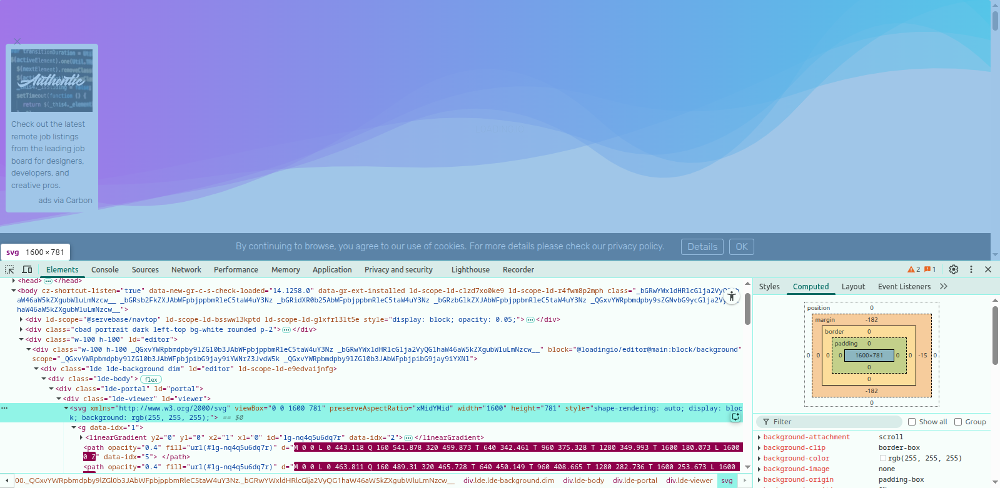

<h1 align="center">Common Resources</h1>

- [UI Component](#ui-component)

## UI Component 
- [Headless ui](https://headlessui.com/) - Completely unstyled, fully accessible UI components, designed to integrate beautifully with Tailwind CSS.

- [Kometa UI Kit](https://kitwind.io/products/kometa/components) - Free multi-purpose UI kit, built with Tailwind CSS.

- [Mamba UI](https://mambaui.com/components) - UI components based on Tailwind CSS.

- [devdojo tailwind css buttons](https://devdojo.com/tailwindcss/buttons#) - A unique collection of Copy & Paste TailwindCSS buttons 

- [loading.io animated background](https://loading.io/background/) - Animated Background Generators in SVG + PNG + GIF + MP4 + WEBM for Your Next Loading Screen. 

